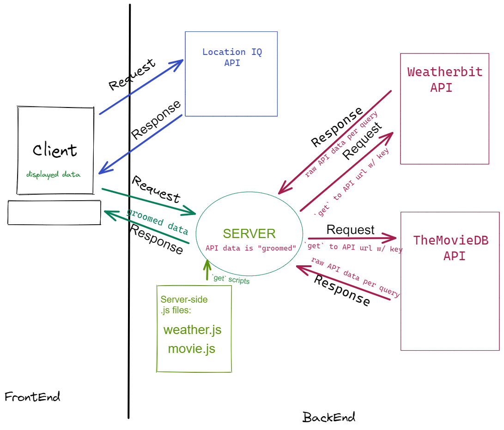

# city-explorer-api

**Author**: Hambalieu Jallow

## Overview
- Performance: As a user, I want the application to work with recent results, so that I can see info without the app doing unnecessary API calls.
- Cache external API data in server storage:

- Given that a user enters a recently unused valid location in the input
- When the user clicks the "Explore!" button
- Then the API results will be loaded from third-party APIs, and stored in server memory for later retrieval.

- Given that a user enters a recently used valid location in the input
- When the user clicks the "Explore!" button
- Then the API results will be returned from a server memory, rather than incurring the delay of repeating the request to third-party APIs.  

## Getting Started
- I used provided starter code and Then i integrated it into my project. I found some bugs in the starter code. Fix them up, until my weather module was running smoothly with an in-memory cache. 
- I added into my modules a global object variable, to act as a place to store values that persist beyond individual request-response cycles. This type of server "memory" is referred to as a "cache".
- I updated my Movies module to require in the cache object. 
- When a new request for movie data arrives, check the cache for a recent API result for the city specified.
- **- If** a recent result is already stored in memory ("cache hit"), return that result, without querying the API again.
- **- If** no recent result is found ("cache miss"), query the API for a fresh result, add it to server memory with the time of retrieval, and return the fresh result.
- I Choose an appropriate definition of "recent", the timespan beyond which deem the data to be stale, and in need of updating ("cache invalidation").
- Consider: Under what circumstances does your server cache get completely reset?
- Deploy my changes to production.

  

  

## TimeStamp:

Name of feature:_building server

Estimate of time needed to complete: _4____

Start time: __12:00am___

Finish time: _4:00____

Actual time needed to complete: ___4__  

## Site Deployment  Link
- [https://hambalieucityexplorer.netlify.app/](https://hambalieucityexplorer.netlify.app/)  

## Site Deployment  Link>
-  [https://trello.com/b/oKobI6sh/city-explorer](https://trello.com/b/oKobI6sh/city-explorer)  

- REACT_APP_WEATHER_API_KEY=<weather Api acces token>  

- MOVIE_API_KEY=<movies api access key>
