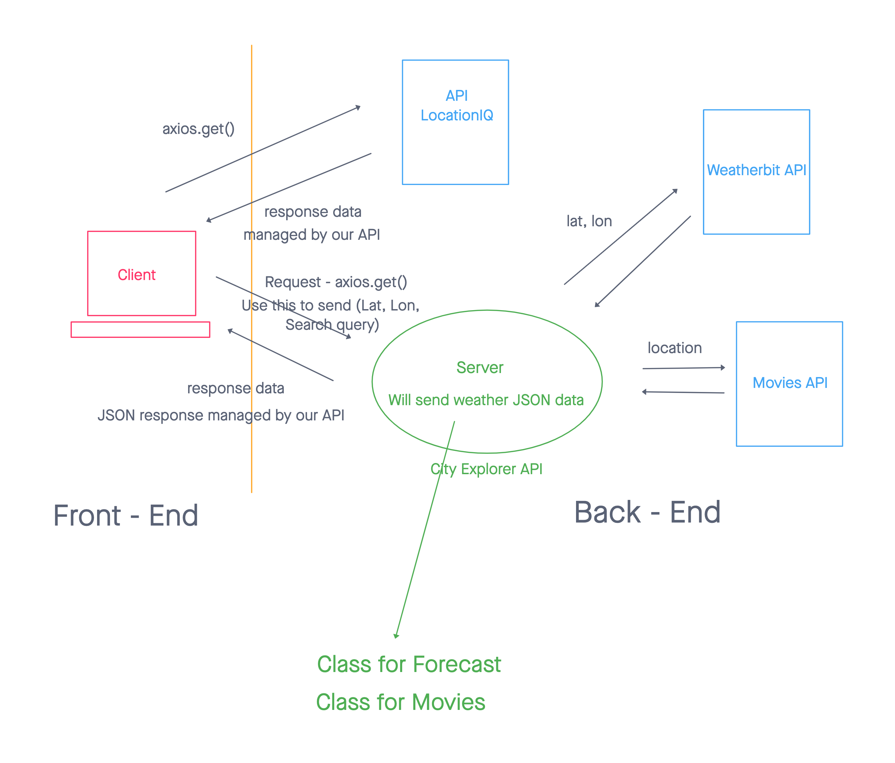

# city-explorer-api

**Author**: Hambalieu Jallow

## Overview
- Weather (placeholder): As a user of City Explorer, You will be able to see weather info for the city you searched, so that you will know how to pack for an upcoming trip

## Getting Started
- set up my repo and my made sure my server was working properly;

## Change Log
- 01-19-2022 4:59pm - Application now has a fully-functional express server, with a GET route for the location resource.

  

  

## TimeStamp:

Name of feature:_building server

Estimate of time needed to complete: _4____

Start time: __2;50___

Finish time: _4____

Actual time needed to complete: ___3__

## Credit and Collaborations
